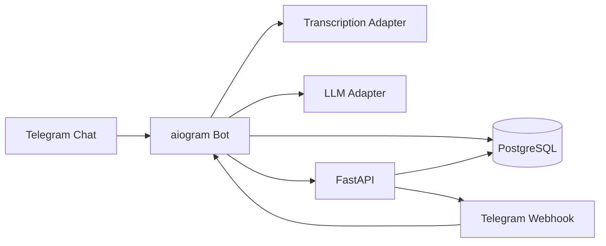

# Telegram Digest Agent

MVP open-source project for an agentic Telegram bot that turns a group chat into a structured digest.

The bot:

- stores group messages in PostgreSQL;
- finds the last message from the invoking user before `/digest`;
- collects everything after that point up to the invocation;
- transcribes `voice`, `audio`, and `video_note`;
- generates a digest in `baseline` or `agent` mode;
- stores a trace for every agent run and evaluates the result.

## Architecture



### Main modules

- `app/main.py` - FastAPI app factory and polling entrypoint.
- `app/telegram/` - aiogram handlers and ingestion flow.
- `app/agent/` - baseline runner, agent runner, trace recorder, evaluator.
- `app/llm/` - OpenAI-compatible adapter and mock provider.
- `app/transcription/` - transcription adapters, Telegram media download, ffmpeg conversion.
- `app/models/` - SQLAlchemy models.
- `app/repositories/` - database access layer.
- `app/api/` - healthcheck, webhook, run and trace endpoints.

## Config

Create a `.env` from `.env.example`.
Never commit your real `.env`; it is ignored by Git.

Required:

- `TELEGRAM_BOT_TOKEN`
- `DATABASE_URL`
- `LLM_BASE_URL`
- `LLM_API_KEY`
- `LLM_MODEL`
- `TRANSCRIPTION_MODE`
- `TRANSCRIPTION_API_KEY`
- `TRANSCRIPTION_MODEL`
- `BOT_MODE`
- `WEBHOOK_URL`

Optional:

- `TRANSCRIPTION_BASE_URL`
- `BOT_USERNAME`

### Cloud LLM setup

The project supports any OpenAI-compatible LLM endpoint. For a cloud deployment with
no local model on the VPS, use Mistral's API:

```env
LLM_BASE_URL=https://api.mistral.ai/v1
LLM_API_KEY=your-mistral-api-key
LLM_MODEL=mistral-small-latest
```

If you want the stronger but usually more expensive option, try:

```env
LLM_MODEL=mistral-large-latest
```

Do not commit real API keys. Rotate any key that was shared in chat.

## Local run

```bash
python -m venv .venv
source .venv/bin/activate
pip install -e .
```

Or use the Makefile:

```bash
make install
```

Run the API:

```bash
uvicorn app.main:create_app --factory --reload
```

Run polling mode:

```bash
BOT_MODE=polling python -m app.main
```

Or:

```bash
make run
```

Run with Docker:

```bash
docker compose up --build
```

For webhook deployments, set `BOT_MODE=webhook` and `WEBHOOK_URL` in `.env`.

## Telegram setup

1. Create a bot with BotFather and copy `TELEGRAM_BOT_TOKEN`.
2. Add the bot to your group.
3. Disable privacy mode if you want the bot to receive all messages.
4. In webhook mode, expose the app and set `WEBHOOK_URL`.

The bot reacts to:

- `/start`
- `/help`
- `/digest`
- `/tasks`
- `/decisions`
- a mention of the bot in a group chat

## Polling mode

Set:

```env
BOT_MODE=polling
```

Then run:

```bash
python -m app.main
```

## Webhook mode

Set:

```env
BOT_MODE=webhook
WEBHOOK_URL=https://your-domain/telegram/webhook
```

Then run the API server and expose port `8000`.

Or use Docker Compose with the same environment values:

```bash
make docker-up
```

Webhook endpoint:

- `POST /telegram/webhook`

## Migrations

Alembic is included.

```bash
alembic upgrade head
```

## API

- `GET /health`
- `POST /telegram/webhook`
- `GET /agent-runs?limit=20`
- `GET /agent-runs/{run_id}/trace`

## Baseline mode

Baseline mode is a one-shot digest pipeline:

1. collect relevant messages;
2. merge text and transcriptions;
3. call the LLM once for the digest;
4. store the result and an evaluation record.

The default command path uses agent mode.

## Agent mode

Agent mode uses a step-by-step loop with state and trace:

- `get_last_user_message`
- `get_messages_after`
- `transcribe_media_messages`
- `group_messages_by_topic`
- `extract_decisions`
- `extract_tasks`
- `generate_digest`
- `evaluate_digest`

Each step is logged in `agent_traces` with:

- `step_id`
- `action`
- `input_json`
- `output_json`
- `latency_ms`
- `status`
- `error`
- `reason_next_step`

To force baseline mode in MVP, include `baseline` in the `/digest` message text, for example:

```text
/digest baseline
```

## Tests

```bash
pytest
```

Or:

```bash
make test
```

Covered by tests:

- last user message lookup;
- selecting messages after the last user message;
- excluding commands and bot messages;
- saving trace rows;
- evaluator JSON parsing;
- baseline runner;
- agent runner with mock tools.

## Lab experiment ideas

- compare baseline vs agent on the same chats;
- compare mock LLM vs real OpenAI-compatible backend;
- compare Whisper API vs local `faster-whisper`;
- vary grouping prompt styles and evaluate trace quality;
- measure digest completeness versus message volume;
- study the effect of media transcription on decision/task extraction.

## Deploy notes

- Build the container with `docker build -t telegram-digest-agent .`.
- For production webhook mode, expose port `8000` behind HTTPS and set `WEBHOOK_URL` to the public Telegram endpoint.
- The Docker image starts through `python -m app.main`, so `BOT_MODE` controls whether the container runs polling or webhook/server mode.
- Add the required environment variables in your deployment platform secrets or `.env` file.

## GitHub / CI

- `.github/workflows/ci.yml` runs tests on push and pull request.
- `.gitignore` excludes local secrets, SQLite files, caches, and virtual environments.
- `.dockerignore` keeps secrets and local build artifacts out of Docker builds.

## Notes

- The project ships with mock LLM and mock transcription providers so it can run without external APIs.
- For real audio transcription on the VPS, use `TRANSCRIPTION_MODE=faster_whisper` with `ffmpeg` installed in the container.
- For cloud LLMs, prefer an OpenAI-compatible endpoint such as Mistral.
- The schema is intentionally MVP-friendly but already split into models, repositories, adapters, and runners.
